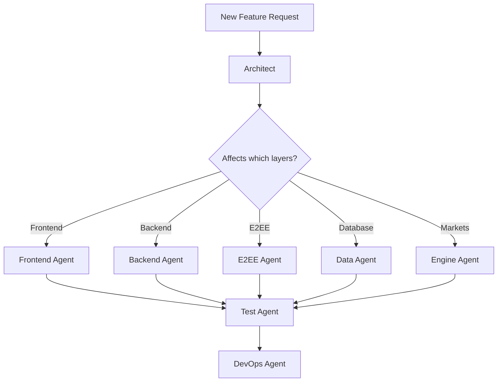

# Agent Orchestrator

## Quick Reference

```
/architect  - System design, cross-cutting concerns
/frontend   - VanJS components, UI/UX, MLS WASM
/backend    - Express.js API, auth, Socket.io
/e2ee       - MLS encryption, OpenMLS WASM
/data       - PostgreSQL schema, queries
/engine     - Rust LMSR market maker
/test       - Testing across all layers
/devops     - Docker, deployment, infrastructure
```

## Orchestration Patterns

### 1. New Feature Development



**Example: "Add group message reactions"**

1. **Architect**: Define reaction data model, API changes, socket events
2. **Data**: Add reactions table, indexes
3. **Backend**: Add reaction endpoints, socket emit
4. **E2EE**: Ensure reactions are encrypted (part of message payload)
5. **Frontend**: Add reaction UI to message bubbles
6. **Test**: Write E2E test for reaction flow
7. **DevOps**: Ensure migration runs on deploy

### 2. E2EE Feature Development

```
1. /e2ee      - Design MLS protocol changes
2. /backend   - Update MLS API routes
3. /frontend  - Update coreCryptoClient.js
4. /test      - Manual two-browser test
```

### 3. Bug Fix Flow

```
1. Reproduce → identify layer
2. Invoke specific agent
3. /test verifies fix
4. /devops for deploy if critical
```

### 4. Performance Optimization

```
1. /architect identifies bottleneck
2. Specific agent implements fix
3. /test adds performance validation
4. /devops updates monitoring
```

## Multi-Agent Tasks

When a task spans multiple domains:

```markdown
## Task: [Description]

### Phase 1: Design (Architect)
- [ ] Define interfaces
- [ ] Document data flow
- [ ] Identify security concerns

### Phase 2: Implementation
- [ ] E2EE: [MLS changes if needed]
- [ ] Data: [schema changes]
- [ ] Backend: [API endpoints]
- [ ] Engine: [market logic if needed]
- [ ] Frontend: [UI components]

### Phase 3: Validation (Test)
- [ ] Manual E2EE test
- [ ] API integration tests
- [ ] E2E tests

### Phase 4: Deploy (DevOps)
- [ ] Run migrations
- [ ] Deploy containers
- [ ] Verify health
```

## Context Passing Between Agents

When handing off:

```markdown
---
FROM: [source-agent]
TO: [target-agent]
CONTEXT: [what was decided/built]
TASK: [what target agent should do]
DEPENDENCIES: [what this work depends on]
CONSTRAINTS: [limitations to respect]
---
```

## Agent Capabilities Matrix

| Capability | Architect | Frontend | Backend | E2EE | Data | Engine | Test | DevOps |
|------------|:---------:|:--------:|:-------:|:----:|:----:|:------:|:----:|:------:|
| System Design | x | | | | | | | |
| VanJS | | x | | | | | | |
| Express.js | | | x | | | | | |
| OpenMLS/WASM | | x | | x | | | | |
| PostgreSQL | | | | | x | | | |
| Rust/LMSR | | | | | | x | | |
| Socket.io | | x | x | | | | | |
| Playwright | | | | | | | x | |
| Docker | | | | | | | | x |

## Common Workflows

### Initialize New MLS Feature
```bash
/e2ee       # Design protocol changes
/backend    # Add MLS API endpoint
/frontend   # Update coreCryptoClient
/test       # Write test scenario
```

### Add New Market Type
```bash
/architect  # Design market mechanics
/engine     # Implement in Rust
/data       # Schema for new market type
/backend    # API endpoints
/frontend   # Market UI
/test       # Test market flow
```

### Debug E2EE Issue
```bash
/e2ee       # Analyze MLS protocol state
# Then specific layer
/frontend   # If WASM integration issue
/backend    # If message relay issue
```

## Emergency Procedures

### Production Bug
1. `/devops` - Check logs, rollback if needed
2. `/architect` - Assess impact
3. Specific agent - Hotfix
4. `/test` - Verify fix
5. `/devops` - Deploy hotfix

### E2EE Failure
1. `/e2ee` - Diagnose MLS state
2. Check IndexedDB state in browser
3. `/backend` - Check message queue
4. `/frontend` - Check WASM initialization

## Best Practices

1. **Start with Architect** for features touching multiple layers
2. **E2EE first** for messaging features
3. **End with Test** to verify changes
4. **Data Agent before Backend** for schema changes
5. **DevOps last** for deployment concerns
