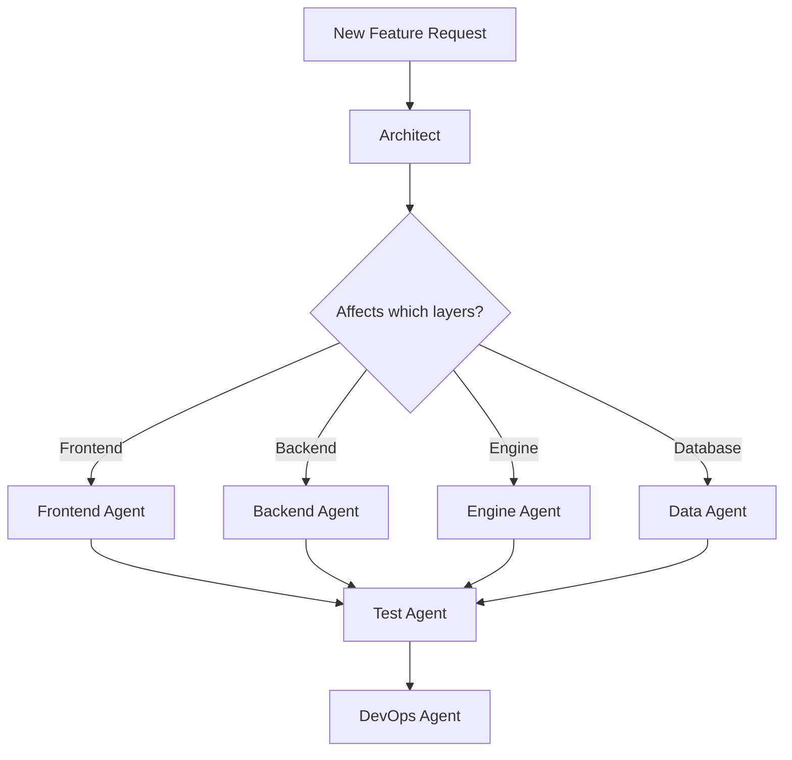

# Agent Orchestrator

## Quick Reference

```
/agent:architect  - System design, cross-cutting concerns
/agent:frontend   - VanJS components, UI/UX  
/agent:backend    - Node.js API, auth, services
/agent:engine     - Rust scoring, market mechanics
/agent:data       - PostgreSQL schema, queries
/agent:test       - Testing across all layers
/agent:devops     - Build, deploy, infrastructure
```

## Orchestration Patterns

### 1. New Feature Development



**Example Flow: "Add prediction confidence levels"**

1. **Architect**: Define confidence impact on visibility scoring, API changes
2. **Engine**: Update scoring algorithm for confidence weighting
3. **Data**: Add confidence column to predictions table
4. **Backend**: Update prediction endpoint schema
5. **Frontend**: Add confidence slider to PredictionCard
6. **Test**: Write tests across all layers
7. **DevOps**: Ensure migration runs in deploy

### 2. Bug Fix Flow

```
1. Reproduce → identify layer
2. Invoke specific agent
3. Test Agent verifies fix
4. DevOps for hotfix deploy if critical
```

### 3. Performance Optimization

```
1. Architect identifies bottleneck
2. Specific agent implements fix
3. Test Agent adds performance tests
4. DevOps updates monitoring
```

## Multi-Agent Tasks

When a task spans multiple domains, use this pattern:

```markdown
## Task: [Description]

### Phase 1: Design (Architect)
- [ ] Define interfaces
- [ ] Document data flow
- [ ] Identify risks

### Phase 2: Implementation
- [ ] Engine: [specific tasks]
- [ ] Backend: [specific tasks]
- [ ] Frontend: [specific tasks]
- [ ] Data: [specific tasks]

### Phase 3: Validation (Test)
- [ ] Unit tests
- [ ] Integration tests
- [ ] E2E tests

### Phase 4: Deploy (DevOps)
- [ ] Migration script
- [ ] Deployment
- [ ] Monitoring
```

## Context Passing Between Agents

When handing off between agents, include:

```markdown
---
FROM: [source-agent]
TO: [target-agent]
CONTEXT: [what was decided/built]
TASK: [what target agent should do]
DEPENDENCIES: [what this work depends on]
CONSTRAINTS: [limitations to respect]
---
```

## Agent Capabilities Matrix

| Capability | Architect | Frontend | Backend | Engine | Data | Test | DevOps |
|------------|:---------:|:--------:|:-------:|:------:|:----:|:----:|:------:|
| System Design | ✅ | | | | | | |
| VanJS | | ✅ | | | | | |
| Node.js | | | ✅ | | | | |
| Rust | | | | ✅ | | | |
| PostgreSQL | | | | | ✅ | | |
| Vitest | | ✅ | ✅ | | | ✅ | |
| Playwright | | | | | | ✅ | |
| Property Testing | | | | ✅ | | ✅ | |
| Docker | | | | | | | ✅ |
| CI/CD | | | | | | | ✅ |
| API Design | ✅ | | ✅ | | | | |
| FFI/napi-rs | | | ✅ | ✅ | | | |

## Common Workflows

### Initialize New Component

```bash
# Frontend component
/agent:frontend create component VisibilityLeaderboard

# Backend route
/agent:backend create route /api/leaderboard

# Engine algorithm
/agent:engine create algorithm leaderboard_ranking
```

### Debug Issue

```bash
# Identify layer first
/agent:architect analyze "visibility scores not updating"

# Then specific agent
/agent:engine debug visibility_calculation
```

### Add Database Migration

```bash
/agent:data migration add_confidence_to_predictions
```

### Review Code

```bash
# Cross-cutting review
/agent:architect review PR#123

# Specific layer
/agent:engine review src/scoring.rs
```

## Emergency Procedures

### Production Bug

1. `/agent:devops` - Check logs, rollback if needed
2. `/agent:architect` - Assess impact
3. Specific agent - Hotfix
4. `/agent:test` - Verify fix
5. `/agent:devops` - Deploy hotfix

### Performance Degradation

1. `/agent:devops` - Check metrics
2. `/agent:architect` - Identify bottleneck
3. `/agent:data` or `/agent:engine` - Optimize
4. `/agent:devops` - Deploy and monitor

## Best Practices

1. **Start with Architect** for features touching multiple layers
2. **End with Test** to verify changes
3. **Use Data Agent** before Backend for schema changes
4. **Coordinate Engine ↔ Backend** for FFI changes
5. **DevOps last** for deployment concerns
